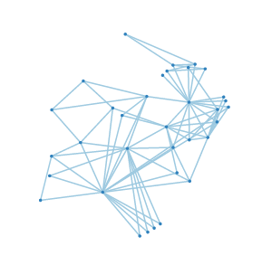
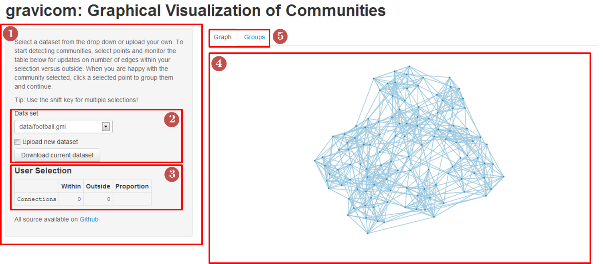
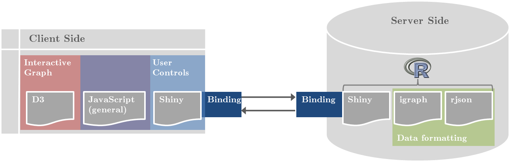
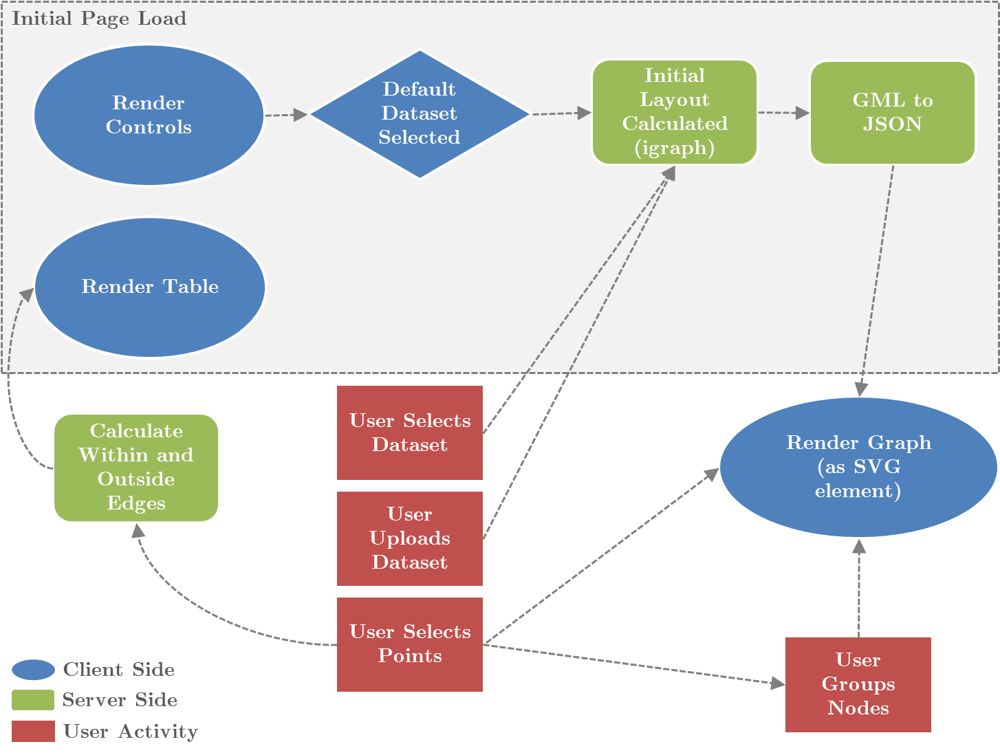
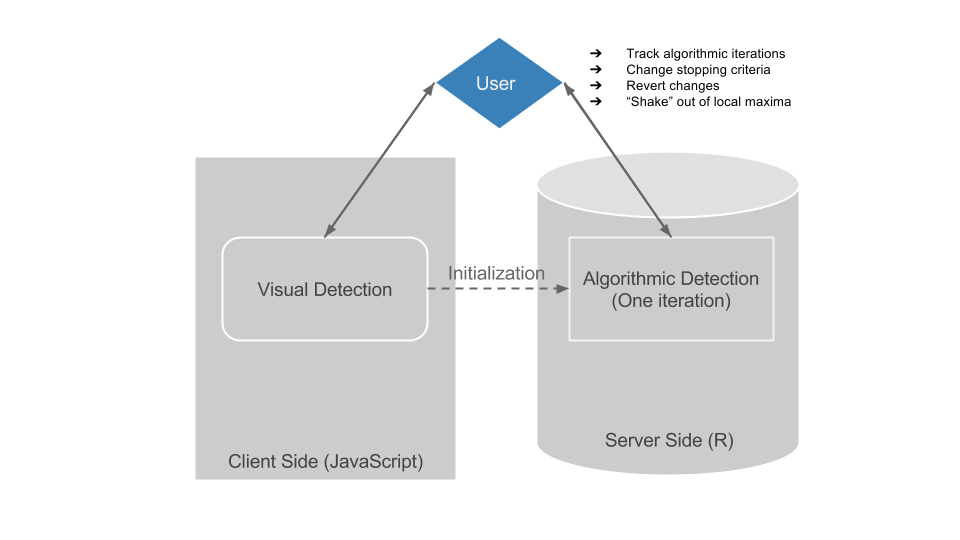

<style>
.reveal section del,
.reveal h1 del {
  color: #FF9900;
}

.reveal section code {
  font-size: 14px;
}
</style>

gravicom
========================================================
author: Andrea Kaplan
date: March 27, 2014
font-family: Helvetica
css: css/charts.css

A web-based tool for community detection in networks

Outline
========================================================

- Introduction/Background
- User Interface
- Demo
- Technical Aspects
- Further Work

Introduction
========================================================
type: section

Who cares and why did we make this?

Networks 
========================================================
- Many relationships easily conceptualized as a graph/network
- A *graph* is defined as a collection of nodes (entities) and edges (relationships)
- Examples of such relationships include:
  - social networks (sociology)
  - the world wide web (computer science)
  - protein networks (biology).
  
Network Examples
========================================================
<a title="Zachary's Karate Club Network" src="http://www1.ind.ku.dk/complexLearning/zachary1977.pdf"></a>
<a title="Internet as of 2005 By The Opte Project [CC-BY-2.5 (http://creativecommons.org/licenses/by/2.5) or CC-BY-2.5 (http://creativecommons.org/licenses/by/2.5)], via Wikimedia Commons" href="http://commons.wikimedia.org/wiki/File%3AInternet_map_1024_-_transparent.png"></a>
<a title="Treponema pallidum By Häuser et al. [CC-BY-1.0 (http://creativecommons.org/licenses/by/1.0)], via Wikimedia Commons" href="http://commons.wikimedia.org/wiki/File%3AThe_protein_interaction_network_of_Treponema_pallidum.png"></a>

Community Detection
========================================================
- A *community* is defined as a group of nodes in a graph that share properties
- *Community structure* - collection of nodes which are densely linked to nodes within the community and sparsely linked to notes outside
- Current methodology for *community detection* often involves an algorithmic approach; partitions a graph into node clusters iteratively before stopping criterion
- First define an objective function and then optimize. 

Community Detection (Cont'd)
========================================================

Example objective function: Girvan & Newman’s modularity measure  

\[ Q = \sum\limits_r (e_{rr} - a_r^2)  \]
\(r \) = a community  
\(e_{rr}\) = fraction of links that connect two nodes inside the community  
\(a_r^2\) = the fraction of links that have one or both vertices inside the community

The Problem
========================================================

Current Solutions
========================================================

Leverage the Human Visual System
========================================================

User Interface
========================================================
type: section

Meet gravicom

Site Components
========================================================
1. Control Panel
1. Data Management
1. Connection table
1. Graph display
1. Tabset

An Interface
========================================================



Demo
========================================================
type: section

http://shiny1.iastate.edu/andeek/gravicom  
<small>(must be VPNed to internal ISU network)</small>

Technical Aspects
========================================================
type: section

What makes it tick?

Tools
========================================================
class: particle-chart

- **Shiny**: Server-client interaction
- **D3**: User interface and graph layout
- **igraph**: Data formatting

Tools (Cont'd)
========================================================


Page Lifecycle
========================================================


Data Formatting
========================================================
GML file structure:

```
graph
[
  directed 0
  node
  [
    id 0
    label "Node 1"
    value 100
  ]
  node
  [
    id 1
    label "Node 2"
    value 200
  ]
  edge
  [
    source 1
    target 0
  ]
]
```


JSON file structure:

```
{
  "nodes":
  [{"id":"n0","v_id":"0","v_label":"Node 1","v_value":"100"}, 
   {"id":"n1","v_id":"1","v_label":"Node 2","v_value":"200"}], 
 "edges":
  [{"source":0, "target":1}]
}
```


Force-Directed Layout
========================================================

Graph Simplification
========================================================


Further Work
========================================================
type: section

Possible extensions to gravicom

Integrated Algorithmic Community Detection
========================================================
- Combine the benefits of human detection of communities with algorithmic detection
- Visual detection of communities serves as an initialization step
- Pass to iterative algorithm
- User tracks progress and has power to dynamically set stopping criterion

How would it work?
=======================================================


Dynamic Temporal Graph Visualization
========================================================
- View a dynamic graph across time -- how the edges change between nodes 
- Detect time-dependent communities
- Add optional node labels to track progress

Questions?
========================================================
type: section

Thank you!

<script type="text/javascript" src="scripts/jquery.min.js"></script>
<script type="text/javascript" src="scripts/d3.v3.min.js"></script>
<script type="text/javascript" src="scripts/charts.js"></script>
<script>$(document).ready(function() { (particleChart())()  });</script>

