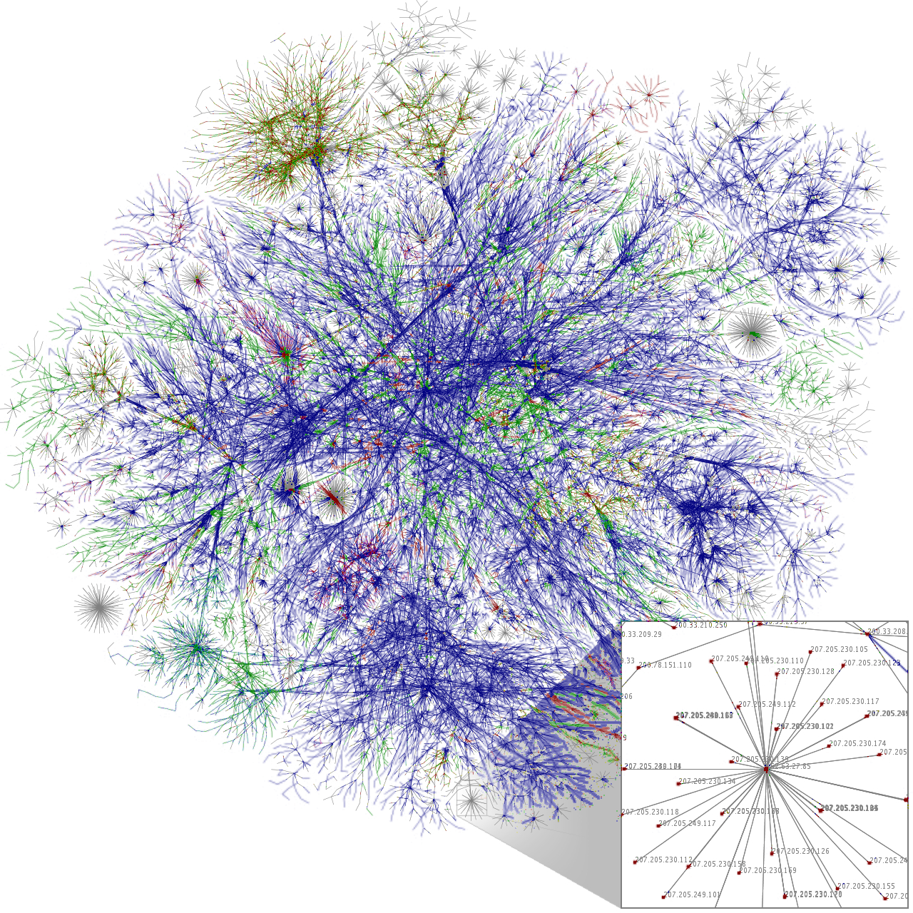

<style>
.reveal section del,
.reveal h1 del,
.reveal h3 del {
  color: #0772A1;
}

.reveal section code {
  font-size: 14px;
}

.reveal, .reveal h3 {
  color: #333333;
}

.reveal table {
  font-size: 14px;
  border-collapse: collapse;
  float: left;
}

/*** section background ***/
.section .reveal .state-background {
   background: #0772A1;
}

/*** navigation color ***/
.reveal .controls div.navigate-left,
.reveal .controls div.navigate-left.enabled {
  border-right-color: #0990CC;
}

.reveal .controls div.navigate-right,
.reveal .controls div.navigate-right.enabled {
  border-left-color: #0990CC;
}

.reveal .controls div.navigate-up,
.reveal .controls div.navigate-up.enabled {
  border-bottom-color: #0990CC;
}

.reveal .controls div.navigate-down,
.reveal .controls div.navigate-down.enabled {
  border-top-color: #0990CC;
}

.reveal .controls div.navigate-left.enabled:hover {
  border-right-color: #0BB5FF;
}

.reveal .controls div.navigate-right.enabled:hover {
  border-left-color: #0BB5FF;
}

.reveal .controls div.navigate-up.enabled:hover {
  border-bottom-color: #0BB5FF;
}

.reveal .controls div.navigate-down.enabled:hover {
  border-top-color: #0BB5FF;
}

.reveal .progress span {
  background: #0990CC;
}

.reveal blockquote {
  background: #0772A1;
  color: white;
}
</style>

gravicom
========================================================
author: Andrea Kaplan
date: March 27, 2014
font-family: Helvetica
css: css/charts.css

A web-based tool for community detection in networks

Outline
========================================================

- Introduction/Background
- User Interface
- Demo
- Graphical Devices
- Technical Aspects
- Further Work

Introduction
========================================================
type: section

Who cares and why did we make this?

Networks 
========================================================
- Many relationships easily conceptualized as a graph/network
- A ~~graph~~ is defined as a collection of nodes (entities) and edges (relationships)
- Examples of such relationships include:
  - social networks (sociology)
  - the world wide web (computer science)
  - protein networks (biology)
  
Network Examples
========================================================
<a title="Zachary's Karate Club Network" src="http://www1.ind.ku.dk/complexLearning/zachary1977.pdf"></a>
<a title="Internet as of 2005 By The Opte Project [CC-BY-2.5 (http://creativecommons.org/licenses/by/2.5) or CC-BY-2.5 (http://creativecommons.org/licenses/by/2.5)], via Wikimedia Commons" href="http://commons.wikimedia.org/wiki/File%3AInternet_map_1024_-_transparent.png"></a>
<a title="Treponema pallidum By Häuser et al. [CC-BY-1.0 (http://creativecommons.org/licenses/by/1.0)], via Wikimedia Commons" href="http://commons.wikimedia.org/wiki/File%3AThe_protein_interaction_network_of_Treponema_pallidum.png"></a>

Community Detection
========================================================
- A ~~community~~ is defined as a group of nodes in a graph that share properties
- ~~Community structure~~ - collection of nodes which are densely linked to nodes within the community and sparsely linked to notes outside
- Current methodology for ~~community detection~~ often involves an algorithmic approach; partitions a graph into node clusters iteratively before stopping criterion
- First define an objective function and then optimize

Community Detection (Cont'd)
========================================================

Example objective function: Girvan & Newman’s modularity measure  

\[ Q = \sum\limits_r (e_{rr} - a_r^2)  \]
\(r \) = a community  
\(e_{rr}\) = fraction of links that connect two nodes inside the community  
\(a_r^2\) = the fraction of links that have one or both vertices inside the community

The Problem
========================================================
- Search for an optimal modularity value is NP-hard 
- The number of possible partitions of the network requires \(2^n\) complexity
- In fact, the optimization of an objective function is typically
an NP-hard problem


Current Solutions
========================================================
- Heuristics used to optimize the objective function in a reasonable amount of time
- Heuristic-based clustering is useful because this offers an automated way to perform community detection 

<blockquote>The main elements of the problem themselves [graph clustering], i.e. the concepts of community and partition, are not rigorously defined, and require some degree of arbitrariness and/or common sense. (Fortunato, 2010)</blockquote>
<br/>
- Heuristics are not ~~the~~ solution.

Leverage the Human Visual System
========================================================
- Communities are often fuzzily-defined human concepts
- Address this by adding element of human judgement
- Introduce a novel visualization-based community detection tool, ~~gravicom~~

gravicom Functionality
========================================================
- Allows users to 
  - Visually direct and interact with the steps of community detection
  - Assess the created clusters through visual and quantitative summaries
- Standalone exploratory tool for graph data
- Initial state to be passed to a community detection algorithm in order reduce the complexity of optimization

User Interface
========================================================
type: section

Meet gravicom

Components
========================================================

(1) Control Panel, (2) Data Management, (3) Connection Table, (4) Graph Display, and (5) Tabset

Demo
========================================================
type: section

http://shiny1.iastate.edu/andeek/gravicom  
<small>(must be VPNed to internal ISU network)</small>

Football Example
========================================================


Football Example (Cont'd)
========================================================
<!-- html table generated in R 3.0.2 by xtable 1.7-1 package -->
<!-- Sun Mar 23 15:27:41 2014 -->
<TABLE border=1>
<TR> <TH> Conference </TH> <TH> Teams Identified </TH> <TH> Accuracy </TH>  </TR>
  <TR> <TD align="center"> ACC </TD> <TD> Duke,  Wake Forest,  Virginia,  Florida State,  Clemson,  North Carolina,  Maryland,  Georgia Tech,  North Carolina State </TD> <TD align="center"> 100% </TD> </TR>
  <TR> <TD align="center"> Big 10 </TD> <TD> Ohio State,  Penn State,  Michigan,  Michigan State,  Purdue,  Minnesota,  Northwestern,  Illinois,  Iowa,  Wisconsin,  Indiana </TD> <TD align="center"> 100% </TD> </TR>
  <TR> <TD align="center"> Big 12 </TD> <TD> Kansas State,  Iowa State,  Kansas,  Texas A& M,  Texas Tech,  Baylor,  Missouri,  Texas,  Oklahoma State,  Colorado,  Oklahoma,  Nebraska </TD> <TD align="center"> 100% </TD> </TR>
  <TR> <TD align="center"> C-USA </TD> <TD> Cincinnati,  Louisville,  Houston,  Tulane,  Southern Mississippi,  Army,  Memphis,  East Carolina,  Alabama Birmingham </TD> <TD align="center"> 100% </TD> </TR>
  <TR> <TD align="center"> Independent </TD> <TD> Notre Dame,  Navy </TD> <TD align="center"> 100% </TD> </TR>
  <TR> <TD align="center"> Pac-10 </TD> <TD> Arizona,  Oregon State,  Washington,  Washington State,  Arizona State,  UC LA,  Stanford,  Southern California,  Oregon,  California </TD> <TD align="center"> 100% </TD> </TR>
   <A NAME=tab:football_final></A>
</TABLE>


Football Example (Cont'd)
========================================================
<!-- html table generated in R 3.0.2 by xtable 1.7-1 package -->
<!-- Sun Mar 23 15:27:41 2014 -->
<TABLE border=1>
<TR> <TH> Conference </TH> <TH> Teams Identified </TH> <TH> Accuracy </TH>  </TR>
  <TR> <TD align="center"> SEC </TD> <TD> Vanderbilt,  Florida,  Louisiana State,  South Carolina,  Mississippi,  Arkansas,  Auburn,  Kentucky,  Georgia,  Mississippi State,  Alabama,  Tennessee </TD> <TD align="center"> 100% </TD> </TR>
  <TR> <TD align="center"> MAC </TD> <TD> <i><del> Central Florida</del></i>,  Western Michigan,  Miami Ohio,  Ohio,  Bowling Green State,  Marshall,  Ball State,  Akron,  Buffalo,  Northern Illinois,  Eastern Michigan,  Toledo,  Central Michigan,  Kent </TD> <TD align="center"> 92.9% </TD> </TR>
  <TR> <TD align="center"> Big East </TD> <TD> Boston College,  Miami Florida,  Virginia Tech,  Syracuse,  Temple,  West Virginia, <i><del> Connecticut</del></i>,  Pittsburgh,  Rutgers </TD> <TD align="center"> 88.9% </TD> </TR>
  <TR> <TD align="center"> WAC </TD> <TD> Nevada,  Fresno State, <i><del> Texas Christian</del></i>,  Tulsa,  Hawaii,  Rice,  Southern Methodist,  San Jose State,  Texas El Paso </TD> <TD align="center"> 88.9% </TD> </TR>
  <TR> <TD align="center"> Big West </TD> <TD> Middle Tennessee State,  Louisiana Lafayette,  Louisiana Monroe, <i><del> Louisiana Tech</del></i> </TD> <TD align="center"> 75% </TD> </TR>
  <TR> <TD align="center"> Mountain West </TD> <TD> Brigham Young,  San Diego State, <i><del> Boise State</del></i>,  Wyoming,  New Mexico,  Nevada Las Vegas,  Utah, <i><del> North Texas</del></i>, <i><del> Utah State</del></i>, <i><del> New Mexico State</del></i>,  Colorado State, <i><del> Arkansas State</del></i>, <i><del> Idaho</del></i>,  Air Force </TD> <TD align="center"> 57.1% </TD> </TR>
   <A NAME=tab:football_final></A>
</TABLE>

- Through manual specification of conferences, we were able to correctly classify 91.3 % of the football teams into their conferences. 

Graphical Devices
========================================================
type: section

Theory behind the curtain

Importance of Graph Layout
========================================================
- ~~Graph layout~~ is an assignment of a Cartesian coordinate to each node for display in 2D or 3D
- Layout of a graph significantly affects the number of communities that users detect within a graph
- Humans used to detect communities \( \Rightarrow \) special attention needs to be paid to the layout being used
- Location of a node spatially relative to other nodes in a cluster has a significant effect on user: "adjacent nodes must be placed near to each other if possible" (McGrath, Blythe, and Krackhardt, 1996)

Force-Directed Layout
========================================================
- Physics based algorithm for graph drawing
- Repulsive forces (charged particles) used to separate all pairs of nodes
- Links are fixed-distance geometric constraints 
- Groups of nodes sharing multiple edges are pulled in closer proximity
- Pseudo-gravity force keeps nodes centered in the visible area and avoids expulsion of disconnected subgraphs

Graph Simplification
========================================================
- Difficult to glean meaning from a visual representation in large/complex graphs 
- Replace repeated patterns in a graph by a representation, to simplify a network
- Fewer nodes and edges to display \( \Rightarrow \) visual complexity of the graph visualization is greatly reduced
- Allows the user to analyze the network structure more accurately

Technical Aspects
========================================================
type: section

What makes it tick?


Page Lifecycle
========================================================


Tools
========================================================
class: particle-chart

- ~~Shiny~~: Server-client interaction
- ~~D3~~: User interface and graph layout
- ~~igraph~~: Data formatting

Tools (Cont'd)
========================================================


Data Formatting
========================================================
GML file structure:

```
graph
[
  directed 0
  node
  [
    id 0
    label "Node 1"
    value 100
  ]
  node
  [
    id 1
    label "Node 2"
    value 200
  ]
  edge
  [
    source 1
    target 0
  ]
]
```


JSON file structure:

```
{
  "nodes":
  [{"id":"n0","v_id":"0","v_label":"Node 1","v_value":"100"}, 
   {"id":"n1","v_id":"1","v_label":"Node 2","v_value":"200"}], 
 "edges":
  [{"source":0, "target":1}]
}
```


Further Work
========================================================
type: section

Possible extensions to gravicom

Integrated Algorithmic Community Detection
========================================================
- Combine the benefits of human detection of communities with algorithmic detection
- Visual detection of communities serves as an initialization step
- Pass to iterative algorithm
- User tracks progress and has power to dynamically set stopping criterion

How would it work?
=======================================================


Dynamic Temporal Graph Visualization
========================================================
- View a dynamic graph across time -- how the edges change between nodes 
- Detect time-dependent communities
- Add optional node labels to track progress

Questions?
========================================================
type: section

Thank you!

<script type="text/javascript" src="scripts/jquery.min.js"></script>
<script type="text/javascript" src="scripts/d3.v3.min.js"></script>
<script type="text/javascript" src="scripts/charts.js"></script>
<script>
$(document).ready(function() { 
  (particleChart())() ;   
});
</script>

